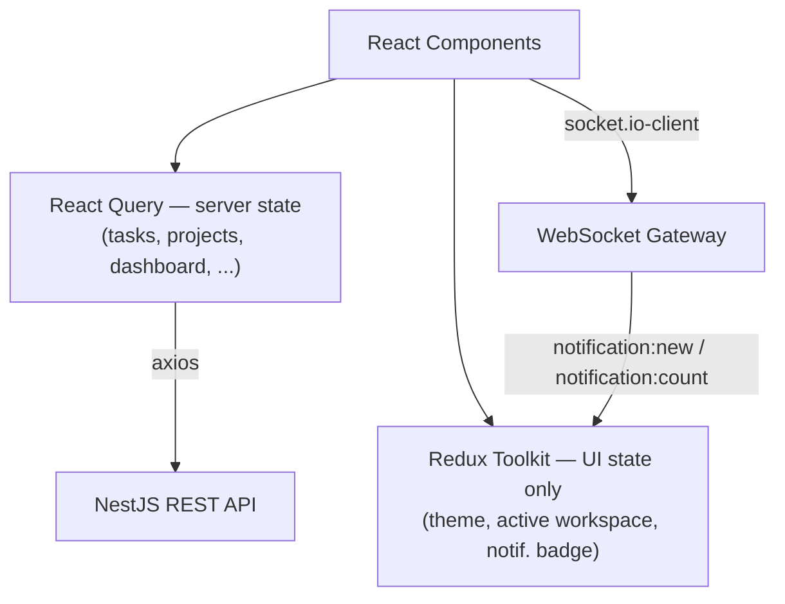

<div align="center">

# TaskFlow — Frontend

**The React client for [TaskFlow](https://github.com/AnarDevJourney/taskflow-backend) — a Jira/Linear-style team & project management app.**

A full-featured SPA: kanban boards with drag-and-drop, sprint planning with burndown/velocity charts, an aggregation-backed analytics dashboard, real-time notifications, per-user customizable tables, and a real System/Light/Dark theme — in three languages.

[](https://react.dev/)
[](https://www.typescriptlang.org/)
[](https://vitejs.dev/)
[](https://ant.design/)
[](https://tanstack.com/query)
[](https://redux-toolkit.js.org/)

[Backend repository →](https://github.com/AnarDevJourney/taskflow-backend)

</div>

---

## Table of Contents

- [What is this?](#what-is-this)
- [Feature Overview](#feature-overview)
- [Tech Stack](#tech-stack)
- [Architecture & State Management](#architecture--state-management)
- [Engineering Deep Dives](#engineering-deep-dives)
  - [Server State vs. Client State — a strict boundary](#1-server-state-vs-client-state--a-strict-boundary)
  - [Streaming Uploads via a Shared Axios Instance](#2-streaming-uploads-via-a-shared-axios-instance)
  - [Real-Time Notifications](#3-real-time-notifications)
  - [Per-User Persisted Preferences](#4-per-user-persisted-preferences-not-localstorage)
  - [Theme System](#5-theme-system-systemlightdark)
  - [Dashboard Charting](#6-dashboard-charting)
- [Project Structure](#project-structure)
- [Getting Started](#getting-started)
- [Environment Variables](#environment-variables)
- [Internationalization](#internationalization)
- [Project Status](#project-status)
- [Author](#author)

---

## What is this?

This is the React client for TaskFlow, a full team & project management platform
built end-to-end as a demonstration of production-grade frontend engineering — not a
UI showcase over mock data. Every screen in this app is backed by a real REST API and
a real WebSocket connection, served by the companion
[NestJS backend](https://github.com/AnarDevJourney/taskflow-backend).

---

## Feature Overview

**Workspaces & Projects**
- Workspace grid with create/edit/archive/restore, member management with role editing
- Project kanban boards with free-form, per-project status columns

**Tasks**
- Kanban board with drag-and-drop (cross-column and same-column reordering) via `@dnd-kit`
- Task detail modal — inline-editable title/description, checklist, attachments, comments, activity
- **My Tasks**: a cross-project task list with **9 selectable layout variants** (classic, compact,
  spreadsheet, cards, kanban, minimal, colorful, avatar, striped) — same data, different presentation
- Server-side search, filtering (status/priority/project), sorting, and pagination
- Column show/hide, drag-to-reorder, and live-resize, all saved per user

**Sprints**
- Sprint sidebar with velocity chart, planned/active/completed views
- Create/start/complete flows, backlog task picker, burndown chart (Recharts)

**Dashboard**
- One request powers the entire page: 4 KPI cards with period-over-period trend chips,
  status/priority donut charts, a 7-day productivity trend line, a per-assignee workload
  bar chart, a GitHub-style 371-day activity heatmap, and a sprint-progress meter
- Deep-linkable: click a donut slice, an activity row, or a workload bar to jump straight
  to the filtered kanban board or activity log entry

**Real-time**
- Live notification bell with unread badge, toast pop-ups, and a full notifications table page
- Socket.io connection authenticated via HttpOnly cookie — no token ever touches client JS

**Files**
- Drag-and-drop or click-to-upload attachments with per-file progress, preview, and delete
- Avatar and workspace-logo uploaders with instant preview

**Activity Log**
- Full workspace audit trail — user/module/action/date-range filters, detail drawer with
  before → after diffs and system info (IP, browser, OS, device)

**Personalization**
- System/Light/Dark theme, applied before first paint (no flash), fully driven by CSS custom properties
- 3 languages (Azerbaijani, English, Russian) via i18next, full coverage
- Sidebar module visibility/order and every table's view/columns/page-size are saved
  **per user, on the backend** — not `localStorage` — so preferences follow the user across devices

**Auth**
- Invite-only registration flow, including "already have an account? just accept the invite" branching
- Automatic 401 → refresh → retry via an Axios interceptor — sessions never silently expire mid-use

---

## Tech Stack

| Layer          | Technology                              | Why                                                              |
| --------------- | ----------------------------------------- | ------------------------------------------------------------------ |
| Framework        | React 19 + TypeScript + Vite                | Fast dev server, strict typing end-to-end                            |
| UI kit             | Ant Design 6                                  | Full component set, theming via `ConfigProvider`                       |
| Server state         | TanStack React Query                            | Caching, refetch, optimistic UI — server data never lives in Redux       |
| Client (UI) state       | Redux Toolkit                                     | Strictly scoped to real UI state (theme, active workspace, notifications) |
| Forms                     | React Hook Form                                     | Uncontrolled-first form performance                                         |
| HTTP                        | Axios                                                 | Cookie-credentialed instance + 401-refresh interceptor                         |
| Routing                       | React Router v6                                         | Client-side routing, protected route wrapper                                     |
| Drag & Drop                     | @dnd-kit                                                  | Kanban cards, column reordering, table-column reordering                            |
| Charts                             | Recharts                                                    | Burndown, velocity, dashboard trend/bar/donut charts                                   |
| Real-time                             | Socket.io-client                                              | Live notification push                                                                   |
| i18n                                     | i18next                                                          | AZ / EN / RU, fully covered                                                                 |
| Dates                                       | dayjs                                                              | Locale-aware date formatting synced to app language                                          |

---

## Architecture & State Management



The rule enforced throughout the codebase: **anything that lives on the server goes
through React Query — never Redux.** Redux is reserved for genuine client-only UI
state (current theme, currently active workspace, the live notification list pushed
by the socket). This keeps cache invalidation, refetching, and staleness entirely in
React Query's hands and avoids the classic "two sources of truth" bug class.

---

## Engineering Deep Dives

### 1. Server State vs. Client State — a strict boundary

Every feature follows the same three-file shape:

```
features/<name>/
├── services/<name>Service.ts   # plain async functions, the only place axios is called
├── hooks/use<Name>.ts          # useQuery / useMutation wrapping the service
└── pages | components/         # UI — reads only from the hook, never calls axios directly
```

```ts
// ✅ services/workspaceService.ts
export const workspaceService = {
  getAll: async (): Promise<Workspace[]> => {
    const res = await api.get<ApiResponse<Workspace[]>>('/workspaces');
    return res.data.data; // envelope unwrapped once, at the boundary
  },
};

// ✅ hooks/useWorkspaces.ts
export const useWorkspaces = () =>
  useQuery({ queryKey: ['workspaces'], queryFn: workspaceService.getAll });
```

This is what makes the task detail modal reliable: it never stores a task *snapshot*
in local state. It stores only the selected task's **id**, and derives the task object
live from the React Query cache — so it always reflects the latest mutation with no
manual re-sync:

```tsx
const selectedTask = selectedTaskId
  ? tasks.find((t) => t._id === selectedTaskId) ?? null
  : null;

<TaskDetailModal key={selectedTask._id} task={selectedTask} ... />
```
`key={task._id}` makes React remount (and fully reset) the modal on task switch —
no `useEffect` cleanup required.

### 2. Streaming Uploads via a Shared Axios Instance

All uploads (attachments, avatars, workspace logos) go through the same shared
`axios` instance as every other request — deliberately **not** Ant Design's `Upload`
component, which owns its own request pipeline and would bypass cookie auth and the
401-refresh interceptor entirely.

This surfaced a real, documented bug: the shared instance sets
`Content-Type: application/json` by default, and axios's default `transformRequest`
reacts to that by serializing `FormData` through `formDataToJSON` — a `File` object
becomes `{}` and the server receives a JSON body with no file at all. The fix is one
line, `headers: { 'Content-Type': null }`, which both skips that conversion *and*
lets the browser set its own multipart boundary. Documented so it never regresses.

### 3. Real-Time Notifications

`useNotificationSocket()` is mounted exactly once, in the app shell, and owns the
entire live channel:

- Connects with `withCredentials: true` — auth is the HttpOnly cookie on the
  handshake; there is no token in JS to manage.
- `notification:new` pushes into Redux, opens a themed toast, and invalidates the
  relevant React Query keys in one place.
- **The unread badge number is always taken from the server payload** — never
  incremented client-side — which is the only way it stays correct once a second
  browser tab marks something read.
- On an `unauthorized` event the client refreshes its access token and reconnects
  (bounded retries) — the server closes the socket deliberately, so Socket.io's own
  auto-reconnect is intentionally not relied on here.

### 4. Per-User Persisted Preferences (not `localStorage`)

Table view, page size, column visibility/order, column widths, and sidebar layout
are **not** browser-local — they're saved server-side per user via a small,
reusable `table-settings` / `sidebar-settings` API, keyed by table name (`myTasks`,
`activityLog`, `notifications`, `members`). A `useRef` guard applies the fetched
settings exactly once on load, before any local change starts saving — getting that
ordering wrong is the one bug this pattern is careful to avoid (defaults silently
overwriting a user's real saved settings).

### 5. Theme System (System/Light/Dark)

A real theme architecture, not a single light palette with a class toggle:

- A tiny inline `<script>` in `index.html` resolves and applies `data-theme` on
  `<html>` **before React mounts** — this, not React state, is what prevents the
  light-mode flash on a hard reload.
- `ThemeProvider` exposes `useTheme()`, listens live to `prefers-color-scheme` when
  the mode is "system", and writes `data-theme` via `useLayoutEffect` so every
  subsequent change lands before paint too.
- Every custom color in the app is a CSS custom property (`var(--token)`); Ant
  Design's own components theme for free via `<ConfigProvider theme={...}>`.
- Chart colors are a deliberately **separate** palette from the UI tokens — Recharts
  writes literal values into SVG attributes, where `var()` doesn't resolve — and were
  run through a contrast/colorblind-separation validator against both real app
  surfaces before being adopted.

### 6. Dashboard Charting

The dashboard page issues exactly **one** query (`useDashboardOverview`); every KPI,
chart, and widget reads from that single response — a new widget extends the shared
type and the backend's aggregation, it never adds a second request. Every chart
component is `memo`-ized and its data transforms are `useMemo`-ized, so an unrelated
re-render (a checkbox toggling, a background refetch landing) can't restart a chart's
entrance animation. The activity heatmap renders 371 cells as plain CSS grid — not a
charting library — with a single delegated hover handler instead of 371 individual
listeners, after an earlier version's per-cell handlers were found to re-render the
entire grid on every pointer movement.

---

## Project Structure

```
src/
├── lib/
│   ├── axios.ts           # shared instance: withCredentials + 401 refresh interceptor
│   ├── queryClient.ts      # React Query client config
│   └── theme/               # ThemeProvider, resolveTheme(), localStorage sync
├── store/                     # Redux: ui slice (theme/workspace), notifications slice
├── router/                      # All routes — public (auth) + protected (AuthGuard-wrapped)
├── components/
│   ├── layout/                    # AppLayout (sidebar + topbar), AuthGuard
│   └── ui/                          # Shared cross-feature components (pagination, columns modal)
└── features/
    ├── auth/            workspaces/       projects/         tasks/
    ├── comments/        sprints/          notifications/    files/
    ├── dashboard/       activity/         search/           settings/
    └── tableSettings/   sidebarSettings/
        each with: services/  hooks/  components/  pages/  utils/
```

---

## Getting Started

### Prerequisites

- Node.js 20+
- The [backend](https://github.com/AnarDevJourney/taskflow-backend) running locally (or reachable)

### Setup

```bash
git clone https://github.com/AnarDevJourney/taskflow-frontend.git
cd taskflow-frontend
npm install
cp .env.example .env    # point VITE_API_URL / VITE_WS_URL at your backend
npm run dev              # http://localhost:5173
```

```bash
npm run build      # production build
npm run preview     # preview the production build locally
npm run lint          # ESLint
```

---

## Environment Variables

```env
VITE_API_URL=http://localhost:3000/api/v1    # backend REST API base URL
VITE_WS_URL=http://localhost:3000            # backend WebSocket base URL (no /api/v1 suffix)
```

---

## Internationalization

Full coverage across **Azerbaijani, English, and Russian** via i18next, including
every table view, filter label, notification/activity message template, and error
string. The app's date locale (via dayjs) stays in sync with the selected language.

---

## Project Status

Feature-complete: authentication, workspaces, projects, kanban board, My Tasks
(9 layout variants), sprints (burndown/velocity), the full aggregation-backed
dashboard, real-time notifications, file uploads, activity log, per-user table/
sidebar customization, and the System/Light/Dark theme system are all implemented
and wired to the [live backend API](https://github.com/AnarDevJourney/taskflow-backend).

---

## Author

**Anar** — [github.com/AnarDevJourney](https://github.com/AnarDevJourney)
